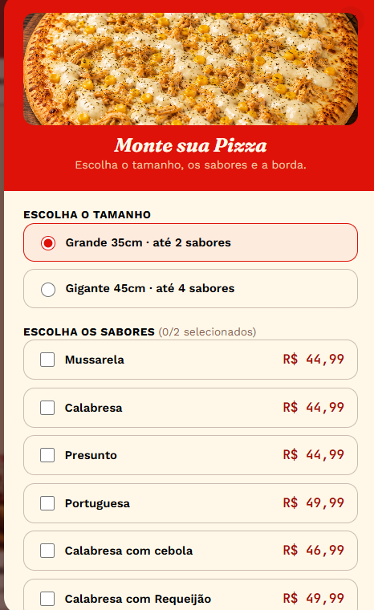
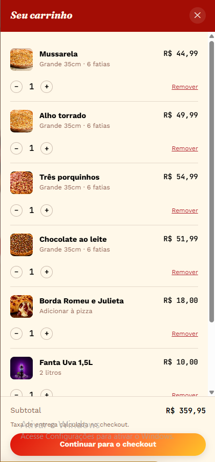
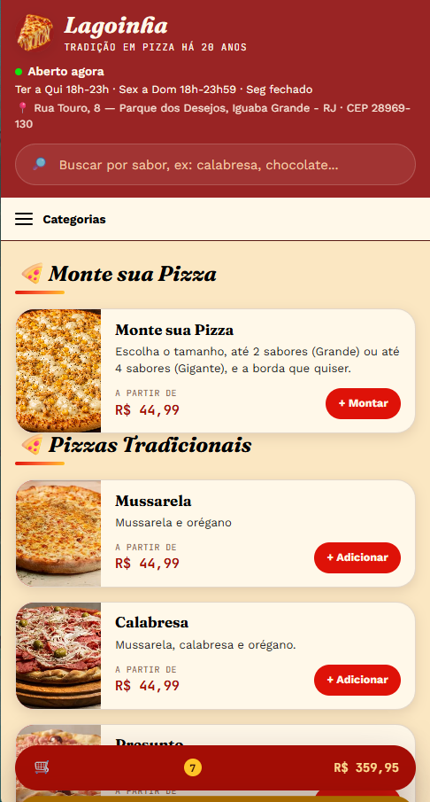

# 🍕 Pizzaria Lagoinha — Cardápio Digital

> Cardápio digital completo para delivery, com carrinho de compras, montador de pizza personalizada e finalização de pedido via WhatsApp — construído do zero em **HTML, CSS e JavaScript puro**, sem frameworks e sem dependências externas.

**[🔗 Ver demo ao vivo](https://pizzaria-lagoinha.vercel.app/)** · **[📱 Testar no celular](https://pizzaria-lagoinha.vercel.app/)**

---

## 💡 Por que este projeto

A maioria dos cardápios digitais de pizzaria resolve o básico: lista de produtos e um botão de WhatsApp. Este projeto vai além — foi construído para se comportar como um **mini e-commerce real**, com as mesmas preocupações de produto e engenharia que um app de delivery de verdade teria: carrinho persistente, personalização de produto (montar a própria pizza), validações de formulário, cálculo de preço condicional e uma experiência responsiva pensada mobile-first.

Todo o código é **vanilla JS** — decisão deliberada para demonstrar domínio dos fundamentos (DOM, eventos, closures, IntersectionObserver, localStorage) sem depender de um framework para resolver o problema por mim.

---

## ✨ Funcionalidades

- **Catálogo dinâmico** — 8 categorias, 40+ produtos, gerado 100% via JavaScript a partir de uma estrutura de dados única (fácil de editar sem tocar em HTML)
- **Busca em tempo real** — filtra por nome e descrição enquanto o cliente digita
- **Monte sua Pizza** — o cliente escolhe o tamanho (Grande/Gigante), até 2 ou 4 sabores simultâneos e uma borda recheada; o preço é recalculado ao vivo seguindo a regra real de pizzaria (cobra pelo sabor mais caro escolhido)
- **Carrinho de compras** — adicionar, ajustar quantidade, remover, com persistência via `localStorage` (o pedido sobrevive a um refresh da página)
- **Checkout completo** — dados do cliente, entrega ou retirada, forma de pagamento (dinheiro com cálculo de troco, cartão, Pix), com validação client-side em cada etapa
- **Pedido finalizado via WhatsApp** — monta automaticamente uma mensagem formatada com todos os itens, valores e observações, e abre o WhatsApp com o texto pronto para envio
- **Status de funcionamento dinâmico** — calcula "Aberto"/"Fechado" em tempo real, com horário configurável por dia da semana
- **Menu adaptativo** — barra de categorias horizontal no desktop; vira menu suspenso (hambúrguer) em telas menores, sempre fixo no topo ao rolar
- **Fallback inteligente de imagens** — cada produto mostra um emoji ilustrativo enquanto não há foto cadastrada, e troca para a foto real automaticamente assim que ela é adicionada — sem precisar tocar em nenhuma linha de código

---

## 🛠️ Stack técnica

| Camada | Tecnologia |
|---|---|
| Estrutura | HTML5 semântico |
| Estilo | CSS3 puro (custom properties, Grid, Flexbox, `:has()`) |
| Comportamento | JavaScript ES6+ (sem frameworks, sem build step) |
| Persistência | `localStorage` |
| Integração | API de mensagens do WhatsApp (`wa.me`) |

**Sem dependências. Sem bundler. Sem `npm install`.** Três arquivos (`index.html`, `style.css` + `mobile.css`, `script.js`) rodam em qualquer navegador, direto do disco ou de qualquer hospedagem estática.

---

## 🏗️ Decisões de arquitetura que valem destacar

Alguns detalhes de engenharia por trás do projeto — o tipo de coisa que só aparece quando se testa em navegador de verdade, não só lendo o código:

- **Rolagem suave própria (`requestAnimationFrame`)**, no lugar do `scroll-behavior: smooth` nativo — que, testado em profundidade, mostrou comportamento inconsistente entre navegadores quando combinado com rolagem disparada via JS
- **`position: sticky` reforçado por `IntersectionObserver`** — a barra de categorias fica fixa no topo com um mecanismo duplo (CSS nativo + JavaScript), garantindo o comportamento mesmo em navegadores onde o `sticky` sozinho não é 100% confiável
- **Modais controlados manualmente** (overlay + classe, em vez de `<dialog>` nativo) — decisão consciente para evitar inconsistências de estilo "de fábrica" entre navegadores
- **Sistema de fallback de fotos à prova de condição de corrida** — cobre inclusive o caso de uma imagem que já falhou ao carregar antes do JavaScript conseguir "escutar" o evento de erro
- **Validação defensiva na busca** — um item sem os dados esperados nunca derruba a filtragem dos demais

---

## 📱 Responsividade

Construído mobile-first, testado em 4 breakpoints (celular, tablet, desktop, desktop grande), com atenção a:
- Modal como *bottom sheet* no celular, centralizado no desktop
- Grade de produtos de 1 a 4 colunas conforme o espaço disponível
- Área de toque adequada em todos os controles interativos
- `safe-area-inset` para compatibilidade com notch/gestos do iOS

---

## 🚀 Como rodar localmente

Não precisa de servidor nem instalação — é só abrir o `index.html` no navegador.

```bash
git clone <url-do-repositorio>
cd cardapio-pizzaria
# abra index.html no navegador, ou use um servidor local simples:
python3 -m http.server 8000
```

Para configurar para outro negócio, edite apenas o topo do `script.js`:

```js
const CONFIGURACAO = {
  numeroWhatsapp: '55XXXXXXXXXXX',
  nomeLoja: 'Nome da Loja',
  taxaEntrega: 6.0,
};
```

---

## 📸 Screenshots




---

## 👤 Sobre

Projeto desenvolvido como estudo de caso de front-end sem frameworks — foco em fundamentos sólidos de JavaScript, CSS responsivo e experiência de usuário para um caso de uso real (delivery via WhatsApp, extremamente comum no mercado brasileiro).

**Contato:** [douglasfernandes855@gmail.com] · [LinkedIn https://www.linkedin.com/in/douglas-fernandes-3a7736227] · [GitHub https://github.com/DouglasFernandesDev]